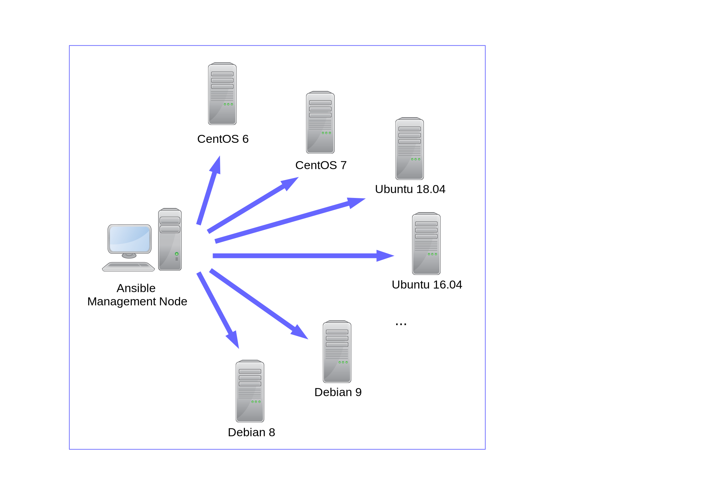

# A Multi-VM Vagrant environment for Developing and Testing Ansible Roles

This is a multi node [Vagrant](https://www.vagrantup.com/ "Vagrant")
environment which represents a real life [Ansible](http://docs.ansible.com/ansible/ "Ansible")
scenario with one Ansible management node and different Linux OS nodes (Ansible
clients):

## Supported Operating Systems

The supported clients are:

* Alpine 3.9,
* Alpine 3.10,
* Alpine 3.11,
* Alpine 3.12,
* CentOS 6, 
* CentOS 7, 
* CentOS 8, 
* Debian 8 (Jessie),
* Debian 9 (Stretch),
* Debian 10 (Buster),
* Fedora 30,
* Fedora 31.
* Fedora 32.
* Ubuntu 14.04 LTS (Trusty Tahr),
* Ubuntu 16.04 LTS (Xenial Xerus),
* Ubuntu 18.04 LTS (Bionic Beaver),
* Ubuntu 19.10 (Eoan Ermine) and
* Ubuntu 20.04 TLS (Focal Fossa).

## Purpose

It is desigend for developing and testing Ansible playbooks and roles on
these operating systems. The configuration can be easily changed to support
other Linux distributions as well. As Vagrant provider (Hypervisors) [VirtualBox](provider/virtualbox.md "VirtualBox")
or [libvirt](provider/libvirt.md) with KVM can be used, default ist VirtualBox.

Of course, you can use this environment to develop and test other things like
Java applications, but that's not the focus of this documentation.

* [Motivation](/motivation/)
* [Getting Started](/getting_started/)
* [Test Ansible Roles](/test_ansible_roles/)
