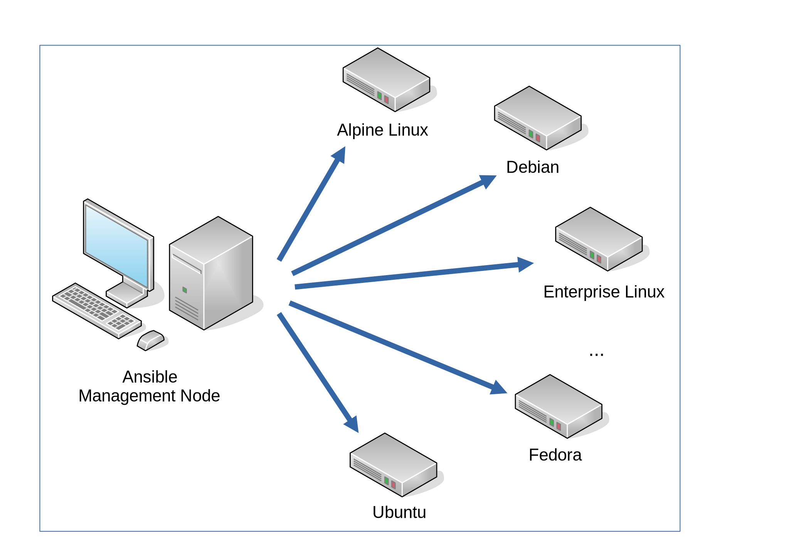

# A Multi-VM Vagrant environment for Developing and Testing Ansible Roles

This is a multi node [Vagrant](https://www.vagrantup.com/ "Vagrant")
environment which represents a real life [Ansible](http://docs.ansible.com/ansible/ "Ansible")
scenario with one Ansible management node and different Linux OS nodes (Ansible
clients):

## Supported Operating Systems

The supported clients are:

* Alpine 3.14,
* Alpine 3.15,
* Alpine 3.15,
* Alpine 3.17,
* Enterprise Linux 7, 
* Enterprise Linux 8, 
* Enterprise Linux 9, 
* Debian 9 (Stretch),
* Debian 10 (Buster),
* Debian 11 (Bullseye),
* Fedora 35,
* Fedora 36.
* Fedora 37.
* Ubuntu 18.04 LTS (Bionic Beaver),
* Ubuntu 20.04 LTS (Focal Fossa),
* Ubuntu 22.04 LTS (Jammy Jellyfish).

## Purpose

It is desigend for developing and testing Ansible playbooks and roles on
these operating systems. The configuration can be easily changed to support
other Linux distributions as well. As Vagrant provider (Hypervisors) [VirtualBox](provider/virtualbox.md "VirtualBox")
or [libvirt](provider/libvirt.md) with KVM can be used, default ist VirtualBox.

Of course, you can use this environment to develop and test other things like
Java applications, but that's not the focus of this documentation.

* [Motivation](/motivation/)
* [Getting Started](/getting_started/)
* [Test Ansible Roles](/test_ansible_roles/)
