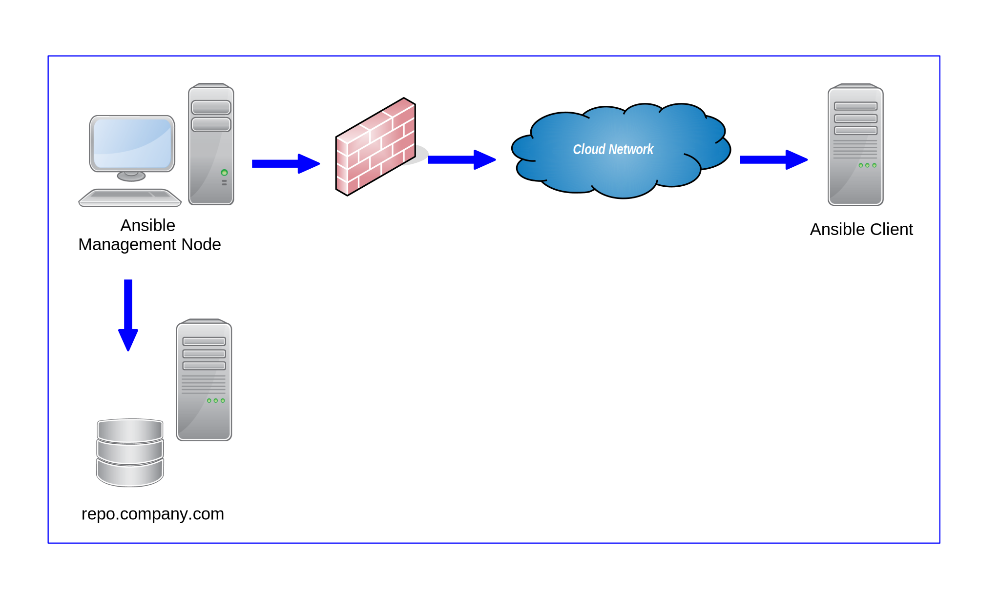

# Motivation

There are many documents and books explaining very good how Ansible playbooks
and roles can be tested using Vagrant and VirtualBox or any other virtualization
system. In most cases, the respective operating system is started and
the playbook is executed with Vagrant's local Ansible provisioner. For example:

```ruby hl_lines="2 6"
Vagrant.configure("2") do |config|
  config.vm.box = "ubuntu/bionic64"
  ...
  # Run Ansible from the Vagrant VM
  config.vm.provision "ansible_local" do |ansible|
    ansible.playbook = "playbook.yml"
    ansible.inventory_path = "inventory.ini"
  end
end
```

The simple Ansible inventory file for the test then looks mostly like this:

```ini
[local]
localhost ansible_connection=local
```

However, if the tested Ansible playbook/role is then run in a production
environment, it may still not work because the test scenario described above has
two major problems:

* First, with the connection type *local* Ansible does not use a SSH connection,
but deploys the playbook directly to the control machine. In the real world, 
there is mostly an Ansible management node from which the playbook is deployed 
on the target system via a SSH connection. This means that problems with the SSH
connection, for example if a special user and/or a special SSH key are required
for establishing the SSH connection on the target system, can not be found in
this way.
* The second, but much more important point is that certain Ansible tasks work
in this test scenario very well but fail in a real production environment. Look
at the following simple example:


```yaml
---
- name: Download WAR file to the Tomcat webapps directory
  maven_artifact:
    group_id: com.company
    artifact_id: web-app
    extension: war
    repository_url: 'https://repo.company.com/maven'
    dest: /var/lib/tomcat7/webapps/web-app.war
```

In this example, a Java WAR file is downloaded from a local Maven repository and
stored on the target system. If you test this on your local Vagrant box, where
Ansible management node and Ansible client are the same machine, and the Vagrant
box has access to the local Maven repository, this will work without problems.
But what happens if the Ansible client is in real life behind a firewall (e.g.
on a cloud system) or for security reasons the client is not allowed to connect
to the Maven repository server, only the Ansible management node? Then this
task doesn't work.

In such a case you have to download the WAR file via *localaction* to the Ansible
management node first and copy them from there to the target system via the ssh
connection like in this example:


```yaml
---
- name: Download WAR file to the Ansible Management node
  localaction:
    module: maven_artifact:
    group_id: com.company
    artifact_id: web-app
    extension: war
    repository_url: 'https://repo.company.com/maven'
    dest: /opt/war/web-app.war

- name: Copy WAR file to the Tomcat webapps directory
  synchronize:
    src: /opt/war/web-app.war
    dest: /var/lib/tomcat7/webapps/web-app.war
```

Of course, these two tasks can also be tested in a single virtual mashine,
where the Ansible management node and the Ansible client are the same. 
However, they can not be guaranteed to work in a production environment because
they have not been tested this way. It makes a difference if more than one
system is involved. That's why this multi node Vagrant environment with one
Ansible management system and several Ansible clients represents a more real
life scenario.

This Vagrant environment is also perfect for testing Ansible roles in a more
complex infrastructure, such as development, staging, and production
environments. To implement this test case, one client is started for each
environment type and assigned to an environment via an Ansible inventory file.
Afterwards, the Ansible playbook/role to be tested can be
executed simultaneously on all three environment types.

